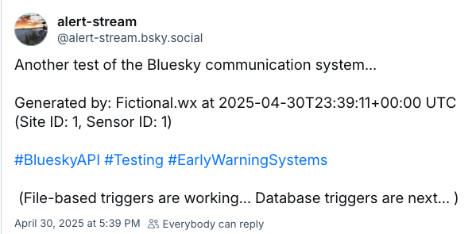

# alert_stream
A collection of tools for alerting on weather events, starting with a script designed to trigger a Bluesky post. 

Writes to https://bsky.app/profile/alert-stream.bsky.social

This scripts run on the 'base station' backend and triggers Bluesky post when called. The message is defined in a `message.yaml` YAML file. These files are generated by base station software. The message attributes are evolving but here is a starting version:

```yaml
message: "Red Rocks Park 30-day rain total: 0.71 inches #RainData #30Day #COWx #MHFD"
created_by: "Base station"
created_at: "2024-07-05T17:30:07+07:00" 
sent_at: "2024-07-05T17:30:38+07:00"  
host: "local_flood_monitoring_district"
host_site_id: 2500
target_channel: "bluesky"
```
 

## Running script

If your alert message files are written to the default `./inbox/` folder, you can call this script from the command line like so:
```bash
    python3 check_alerts.py
```

## Script options

This script supports the following settings:
* `ALERT_CHECK_INTERVAL`: How often to check for new alerts (in minutes). Default is 5.
* `INBOX_ROOT`: Path to the directory where alert messages are stored. Default is `./inbox`.
* `VERBOSE`: Whether to print additional information during execution. Default is False.

These can be set in a `settings.yaml` file or passed as command-line arguments. The scripts will first load the `settings.yaml` file and then override those values with any command line arguments.

### `settings.yaml` file

The script options can be set in a local `settings.yaml` file located at the same level as the Python script. Here's how it looks: 
```yaml
ALERT_CHECK_INTERVAL: 5
INBOX_ROOT: ./inbox/
VERBOSE: false
```  

### Command line options

These attributes can also be specified with command line options. For instance, to set the interval to 1 minute and enable verbose output, you would use:
```bash
    python3 check_alerts.py --interval 1 --verbose
``` 

To see all available command line options, simply run the script without any arguments:
```bash
    python3 check_alerts.py -h
``` 

